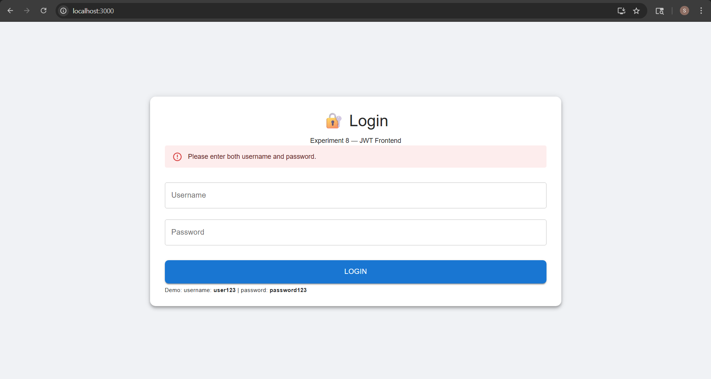

# Experiment 8 — Frontend Integration with JWT APIs (Session-Based UI)

## Student Details

| Field | Value |
|---|---|
| Name | Simar Saini |
| UID | 23bai70318 |
| Course | Full Stack Development |
| Experiment | 8 |
| Deadline | 17 April 2026 |

---

## What is This Experiment?

This experiment is about building a **React frontend** that connects to a **JWT-secured Spring Boot backend** (built in Experiment 6).

The goal is to show how a real-world login system works on the frontend side — where the user logs in, receives a token, stores it in the browser session, uses it to access protected pages, and logs out by clearing the session.

This is called **Session-Based Authentication** — the token lives only as long as the browser tab is open.

---

## What Was Done

### 1. Login Page was built
A login form was created where the user enters their username and password. When they click Login, the form sends a POST request to the backend `/login` endpoint. If the credentials are correct, the backend returns a JWT token. That token is saved in the browser's `sessionStorage` and the user is redirected to the Dashboard.

### 2. Protected Dashboard Page was built
A dashboard page was created that can only be accessed if a JWT token exists in `sessionStorage`. When the user clicks the "Fetch Protected Data" button, a GET request is sent to `/protected` with the JWT token attached in the Authorization header. The backend verifies the token and returns a success response which is displayed on the screen.

### 3. Logout was implemented
A logout button was added on the dashboard. When clicked, it removes the token from `sessionStorage` and redirects the user back to the login page. After logout, accessing `/dashboard` directly redirects back to login since the token no longer exists.

### 4. Route Protection was implemented
React Router was used to set up two routes — `/` for Login and `/dashboard` for Dashboard. The Dashboard component checks for the token on load. If no token is found, it immediately redirects to the login page. This prevents unauthorized users from accessing the dashboard.

### 5. Error Handling was added
If the user enters wrong credentials, an error alert is shown on the login page. If the token is expired or invalid when fetching protected data, a 401 Unauthorized error message is shown on the dashboard.

---

## How It Was Done

### Step 1: React Project was created

A new React project was created using Create React App:

```bash
npx create-react-app experiment8
cd experiment8
```

### Step 2: Required libraries were installed

```bash
npm install axios bootstrap react-router-dom @mui/material @emotion/react @emotion/styled
```

- **axios** — used to make HTTP requests to the backend
- **bootstrap** — used for layout and basic styling
- **react-router-dom** — used to set up page navigation between Login and Dashboard
- **@mui/material** — used for UI components like TextField, Button, Card, Alert, Chip

### Step 3: Bootstrap was imported globally

In `src/index.js`, Bootstrap CSS was imported so it applies to the entire app:

```js
import 'bootstrap/dist/css/bootstrap.min.css';
```

### Step 4: React Router was configured in App.js

Two routes were defined — one for the Login page and one for the Dashboard:

```jsx
import { BrowserRouter as Router, Routes, Route } from "react-router-dom";
import Login from "./components/Login";
import Dashboard from "./components/Dashboard";

function App() {
  return (
    <Router>
      <Routes>
        <Route path="/" element={<Login />} />
        <Route path="/dashboard" element={<Dashboard />} />
      </Routes>
    </Router>
  );
}
```

### Step 5: Login.js was created

The Login component has two input fields for username and password. When the Login button is clicked, it calls the `/login` endpoint using axios POST request.

```jsx
const login = async () => {
  try {
    const res = await axios.post("http://localhost:8080/login", {
      username,
      password,
    });

    if (res.data.token) {
      sessionStorage.setItem("token", res.data.token);
      sessionStorage.setItem("username", username);
      window.location.href = "/dashboard";
    }
  } catch (err) {
    setError("Invalid credentials. Please try again.");
  }
};
```

**What happens here:**
- `axios.post` sends the username and password to the Spring Boot backend
- If a token comes back in the response, it is saved to `sessionStorage` using `sessionStorage.setItem`
- The user is then redirected to `/dashboard`
- If the credentials are wrong, the catch block runs and shows an error alert

### Step 6: Dashboard.js was created

The Dashboard component first checks if a token exists. If not, it redirects to login immediately.

```jsx
useEffect(() => {
  if (!token) {
    window.location.href = "/";
  }
}, []);
```

When the user clicks "Fetch Protected Data", it sends a GET request with the token in the Authorization header:

```jsx
const fetchProtectedData = async () => {
  try {
    const res = await axios.get("http://localhost:8080/protected", {
      headers: {
        Authorization: "Bearer " + token,
      },
    });
    setData(res.data.message);
  } catch (err) {
    setError("401 Unauthorized — Token expired or invalid.");
  }
};
```

**What happens here:**
- The token is retrieved from `sessionStorage`
- It is attached to the request headers as `Authorization: Bearer <token>`
- The backend validates the token and returns the protected data
- If the token is expired or missing, a 401 error is caught and shown

### Step 7: Logout was implemented

```jsx
const logout = () => {
  sessionStorage.removeItem("token");
  sessionStorage.removeItem("username");
  window.location.href = "/";
};
```

**What happens here:**
- `sessionStorage.removeItem` deletes the token from the browser session
- The user is redirected back to the login page
- Since the token is gone, trying to go back to `/dashboard` will redirect to login again

---

## How the Full Flow Works

```
User opens app at localhost:3000
          ↓
Login page shown
          ↓
User enters username + password → clicks Login
          ↓
POST request sent to http://localhost:8080/login
          ↓
Backend validates credentials → returns JWT token
          ↓
Token saved in sessionStorage
          ↓
User redirected to /dashboard
          ↓
Dashboard loads → checks sessionStorage for token
          ↓
User clicks "Fetch Protected Data"
          ↓
GET request sent to /protected with Authorization: Bearer <token>
          ↓
Backend validates token → returns protected data
          ↓
Data displayed on screen
          ↓
User clicks Logout
          ↓
Token removed from sessionStorage → redirected to Login
```

---

## Project Structure

```
experiment8/
├── src/
│   ├── components/
│   │   ├── Login.js         → Login form, calls POST /login, stores token
│   │   └── Dashboard.js     → Protected page, calls GET /protected with token
│   ├── App.js               → React Router setup with two routes
│   └── index.js             → Bootstrap import, React root render
├── screenshots/
│   ├── login.png
│   ├── dashboard.png
│   ├── protected-data.png
│   ├── session-storage.png
│   └── logout.png
├── package.json
└── README.md
```

---

## API Endpoints Used

| Method | Endpoint | What it does | Auth Required |
|---|---|---|---|
| POST | `/login` | Takes username & password, returns JWT token | No |
| GET | `/protected` | Returns protected message if token is valid | Yes — Bearer Token |

---

## Demo Credentials

| Username | Password | Role |
|---|---|---|
| user123 | password123 | USER |
| admin1 | admin123 | ADMIN |

---

## Screenshots

### 1. Login Page


### 2. Dashboard with Token Display


### 3. Protected Data Fetched Successfully


### 4. Invalid credentials


---

---

## Summary

In this experiment, a complete React frontend was built that works with a JWT-secured Spring Boot backend. The user logs in through a form, receives a token, and that token is stored in the browser's sessionStorage. Every time a protected API is called, the token is sent in the Authorization header. The dashboard is protected — if no token exists, the user is redirected to login. On logout, the token is cleared from the session. Bootstrap and Material UI were used together to build a clean, modern, and responsive UI.
